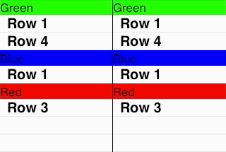

# PHFArrayComparator

Easily animate table changes. This animation shows a two table views side by
side, the left one does not use animations while the right one does.



This little class is intended to be used with `UITableView` and other collection
like views.  It's purpose is to facilitate the smooth update of displayed data.
It does that by telling you what is gone, what moved, and what is new in the
data.  These can then be directly translated to table view methods that insert,
move, and delete rows or sections.

## Installation

The prefered way is to use [CococaPods](http://cocoapods.org).

```ruby
pod 'PHFArrayComparator', '~> 1.0.0'
```

If you can't use CocoaPods for some reason (you really should though, it's the
cool kid on the block), then grab the `PHFRefreshControl.{h,m}` files and put it
in your project.  The code uses ARC, so make sure to turn that on for this file
if you're not already using ARC.

## Usage

```objectivec
NSArray *a = @[ @"A", @"B", @"C" ];
NSArray *b = @[ @"X", @"C", @"B", @"D" ];
NSDictionary *instructions = [PHFArrayComparator compareOldArray:a withNewArray:b];
```

`instructions` contains three keys:

- `PHFArrayComparatorDeletesKey`:  An array of arrays containing two `NSNumber`s
  indicating index and count of items that were removed from the old array, e.g.
  `[2, 3]` means 3 items were removed at index 2.
- `PHFArrayComparatorMovesKey`:  An array of arrays containing two `NSNumber`s
  indicating the old and new index of a persisted item (i.e. an item present) in
  terms of the old array that needed to be swapped with another persited item in
  order to respect the new item order.
- `PHFArrayComparatorInsertsKey`:  An array of arrays containing two `NSNumber`s
  indicating index and count of items that were inserted in the new array.

Thus, the content of `instructions` looks as follows (in JSON notation).

```json
{
  "PHFArrayComparatorDeletesKey": [[0, 1]],
  "PHFArrayComparatorMovesKey":   [[2, 1], [1, 2]],
  "PHFArrayComparatorInsertsKey": [[0, 1], [3, 1]]
}
```

For full working examples, have a look at the Xcode project in `Examples/`.

## Small Print

### License

`PHFArrayComparator` is released under the MIT license.

### Author

Philipe Fatio ([@fphilipe](http://twitter.com/fphilipe))

